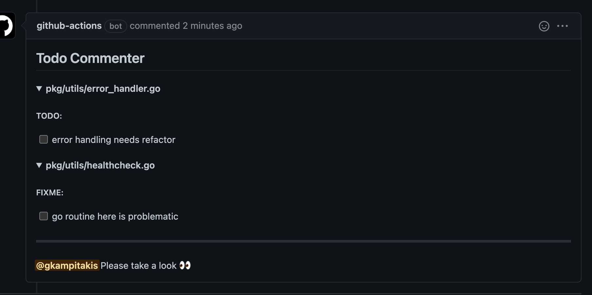

# Github Action Todo Commenter

Parses pull request files based on tags and creates a comment with a task list

## Usage

```yaml
name: Todo Comments
on: [pull_request]

jobs:
  todo-comments:
    runs-on: ubuntu-latest
    steps:
      - name: Checkout
        uses: actions/checkout@v2
      - name: Create Todo Comments
        uses: gkampitakis/github-action-todo-commenter@v1
        with:
          github-token: ${{ secrets.GITHUB_TOKEN }}
          ignore-pattern: '.js$|.snap$'
          review-message: "Please take a look :eyes:"
```

<!-- NOTE: add default values here and more info -->
## Example



---

License MIT